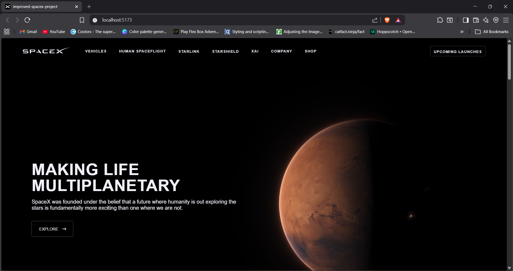
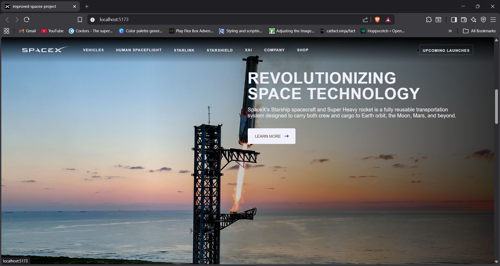

# 🚀 SpaceX Landing Page Clone (React)

## 📌 Project Overview

This project is a SpaceX Landing Page Clone built using React.js.
It replicates the design and layout of the official SpaceX homepage, focusing on component-based architecture, reusable UI elements, and clean styling.

The goal of this project was to improve my understanding of:

- React components
- Props
- State management
- Conditional rendering
- Layout structuring
- CSS styling and positioning

## 🛠️ Tech Stack

- ⚛️ React.js
- 🎨 CSS3
- 📦 JavaScript (ES6+)

## ✨ Features

- Reusable Navbar component
- Hero sections rendered dynamically
- Clean layout structure
- Component-based architecture
- Smooth UI styling

## 📚 What I Learned

- How to break a UI into reusable React components
- Passing data using props
- Rendering multiple sections using .map()
- Handling layout and styling in React projects
- Structuring a React project properly

## ⚠️ Limitations

- ❌ Not responsive (currently optimized for desktop view only)
- ❌ No backend or API integration

## 🚀 Future Improvements

- Make the website fully responsive (Mobile + Tablet)
- Add animations and scroll effects
- Improve performance optimization
- Deploy the project online

## 📷 Preview

